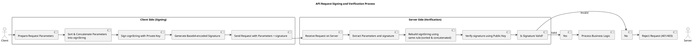

# API Authorization Demo

Use an asymmetric encryption algorithm to sign the parameters when making a request, and have the server verify the signature of the incoming request.

```plantuml
@startuml
title API Request Signing and Verification Process

actor Client
actor Server

rectangle "Client Side (Signing)" {
    Client -> [Prepare Request Parameters]
    [Prepare Request Parameters] -> [Sort & Concatenate Parameters\ninto signString]
    [Sort & Concatenate Parameters\ninto signString] -> [Sign signString with Private Key]
    [Sign signString with Private Key] -> [Generate Base64-encoded Signature]
    [Generate Base64-encoded Signature] -> [Send Request with Parameters + signature]
}

rectangle "Server Side (Verification)" {
    [Send Request with Parameters + signature] -> [Receive Request on Server]
    [Receive Request on Server] -> [Extract Parameters and signature]
    [Extract Parameters and signature] -> [Rebuild signString using\nsame rule (sorted & concatenated)]
    [Rebuild signString using\nsame rule (sorted & concatenated)] -> [Verify signature using Public Key]
    [Verify signature using Public Key] -> [Is Signature Valid?]
}

[Is Signature Valid?] -> [Yes]: Valid
[Yes] -> [Process Business Logic]
[Is Signature Valid?] -> [No]: Invalid
[No] -> [Reject Request (401/403)]

@enduml
```

