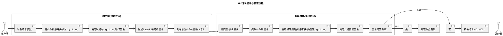

# API授权演示

在发起请求时使用非对称加密算法对参数进行签名，并由服务器对传入请求进行签名验证。

```plantuml
@startuml
title API请求签名与验证流程

actor 客户端
actor 服务器

rectangle "客户端(签名过程)" {
    客户端 -> [准备请求参数]
    [准备请求参数] -> [将参数排序并拼接为signString]
    [将参数排序并拼接为signString] -> [使用私钥对signString进行签名]
    [使用私钥对signString进行签名] -> [生成Base64编码的签名]
    [生成Base64编码的签名] -> [发送包含参数+签名的请求]
}

rectangle "服务器端(验证过程)" {
    [发送包含参数+签名的请求] -> [服务器接收请求]
    [服务器接收请求] -> [提取参数和签名]
    [提取参数和签名] -> [使用相同规则(排序和拼接)重建signString]
    [使用相同规则(排序和拼接)重建signString] -> [使用公钥验证签名]
    [使用公钥验证签名] -> [签名是否有效?]
}

[签名是否有效?] -> [是]: 有效
[是] -> [处理业务逻辑]
[签名是否有效?] -> [否]: 无效
[否] -> [拒绝请求(401/403)]
@enduml
```

